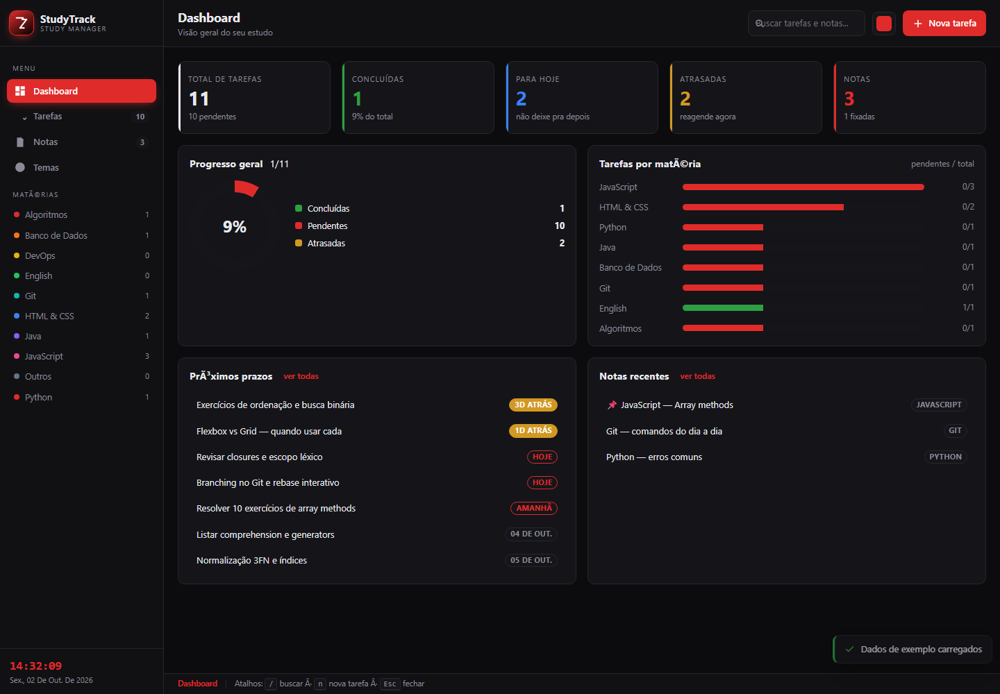
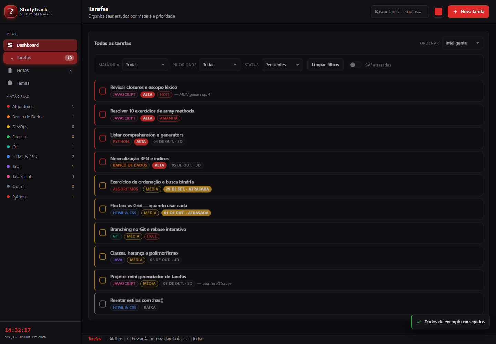
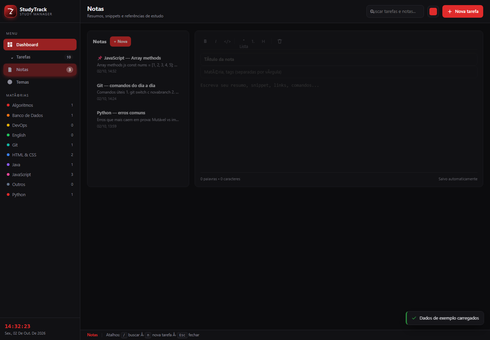
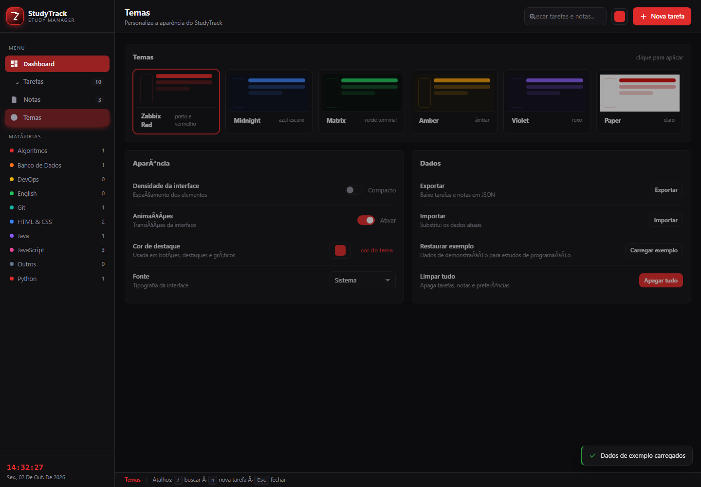

<div align="center">


# StudyTrack

**A Zabbix-inspired study task manager &amp; note-taking app for programming students.**

Zero dependencies · Runs offline · Everything in `localStorage`

[](https://developer.mozilla.org/en-US/docs/Web/HTML)
[](https://developer.mozilla.org/en-US/docs/Web/CSS)
[](https://developer.mozilla.org/en-US/docs/Web/JavaScript)
[](#)
[](#)
[](LICENSE)

[Features](#features) · [Screenshots](#screenshots) · [Quick start](#quick-start) · [Keyboard shortcuts](#keyboard-shortcuts) · [Themes](#themes) · [Data &amp; storage](#data--storage) · [Project structure](#project-structure) · [Roadmap](#roadmap) · [License](#license)

</div>

---

## What is it?

Most study trackers are cheerful to-do apps with a green "all done!" button. StudyTrack takes a different route: the look and feel of an **operations console** — dark, dense, red alerts, live metrics.

It was built for one specific person: someone learning to program, juggling subjects like *JavaScript*, *Python*, *Databases* and *Algorithms*, who wants a single screen that answers three questions without any fuss:

1. **What do I study today?**
2. **Am I actually progressing?**
3. **Where did I write that command I need again?**

No accounts, no backend, no sync, no telemetry. Open the file, start studying.

## Features

<table>
<tr>
<td width="50%" valign="top">

**Dashboard**

- 5 live stat cards — total, completed, due today, overdue, notes
- Progress ring with an overall completion percentage
- Horizontal bar chart of completed vs. pending tasks **per subject**
- *Up next* list of the nearest deadlines
- Recently edited notes at a glance

**Tasks**

- Subject, priority (**high / medium / low**) and due date per task
- Filters by subject, priority, status and *overdue only*
- 5 sort modes: smart, due date, priority, created, title
- Instant search across title, subject and notes
- Colour-coded deadline badges — *today*, *tomorrow*, *overdue*
- Click a card to edit, hover to reveal actions
- Subject sidebar with live pending counters
- Start from scratch or load 11 example tasks

</td>
<td valign="top">

**Notes**

- Auto-saving editor — type, never lose anything
- Lightweight Markdown: `**bold**`, `*italic*`, `` `code` ``, lists, headings
- Toolbar buttons for all of it
- Tags per note (used as subjects in search)
- Pin important notes to the top
- Live word and character counter

**Themes**

- 6 built-in themes: **Zabbix Red**, Midnight, Matrix, Amber, Violet, Paper
- Custom accent colour picker
- Compact density mode
- System / monospace / serif fonts
- Animations toggle

**Everything else**

- ✅ 100% offline, no network requests ever
- ✅ JSON export &amp; import
- ✅ Live clock and status bar
- ✅ Keyboard shortcuts
- ✅ Fully responsive (mobile sidebar drawer)
- ✅ WCAG AA contrast on every theme

</td>
</tr>
</table>

## Screenshots

### Dashboard


### Tasks


### Notes


### Themes


## Quick start

**No build step, no package manager, no install.**

```bash
git clone https://github.com/your-username/studytrack.git
cd studytrack
```

Then either:

- **Double-click `index.html`**, or
- serve it locally (recommended, avoids any `file://` quirks):

```bash
python -m http.server 8000     # then open http://localhost:8000
```

First launch seeds 11 example tasks and 3 example notes. Go to **Themes → Data → Clear all** to start from zero.

## Keyboard shortcuts

| Key | Action |
| :-- | :----- |
| <kbd>/</kbd> | Focus search |
| <kbd>N</kbd> | New task |
| <kbd>Esc</kbd> | Close modal / sidebar |

## Themes

All six themes are pure CSS custom properties — no image assets, no extra stylesheets.

| Theme | Accent | Best for |
| :----- | :----- | :------- |
| **Zabbix Red** | `#e02b2b` | The default. Classic NOC console look. |
| **Midnight** | `#3b82f6` | Long late-night sessions. |
| **Matrix** | `#22c55e` | Terminal vibes. |
| **Amber** | `#f59e0b` | Retro CRT / old-school monitoring. |
| **Violet** | `#8b5cf6` | Something softer. |
| **Paper** | `#d40d0d` | Daylight and printable. |

Picking a **custom accent** is safe: the app measures the colour and automatically darkens it until white button labels stay readable (WCAG AA, ≥ 4.5:1). Use *Themes → Appearance → color of the theme* to switch back.

## Data &amp; storage

Everything lives in `localStorage` under three keys — no server, no cookies:

| Key | Contents |
| :--- | :------- |
| `studytrack.tasks` | `Task[]` |
| `studytrack.notes` | `Note[]` |
| `studytrack.prefs` | Theme, accent, density, font, motion |

Task shape:

```json
{
  "id": "m1x2y3z4ab",
  "title": "Praticar async/await",
  "subject": "JavaScript",
  "priority": "alta",
  "due": "2026-03-14",
  "done": false,
  "notes": "MDN guide ch. 4",
  "createdAt": 1772400000000,
  "completedAt": null
}
```

The UI is in Brazilian Portuguese, so `priority` is stored as `alta`, `media` or `baixa` (high / medium / low). Dates are ISO `YYYY-MM-DD`.

> Clearing your browser data erases localStorage. Use **Themes → Data → Export** for a JSON backup.

## Project structure

```
studytrack/
├── index.html        # markup for all four views
├── css/
│   └── style.css     # theme variables, layout, components
├── js/
│   └── app.js        # state, rendering, storage, events
├── docs/             # logo & screenshots used in this README
└── LICENSE
```

Vanilla HTML, CSS and JavaScript — no framework, no bundler, no dependencies to install.

## Roadmap

- [ ] Pomodoro timer in the status bar
- [ ] Spaced-repetition review queue for notes
- [ ] Drag &amp; drop reordering
- [ ] Weekly/monthly activity heatmap
- [ ] Optional cloud sync (still opt-in)
- [ ] PWA installable offline

Contributions are welcome — open an issue or a PR.

## License

Released under the [MIT License](LICENSE).

---

<div align="center">

Made for people learning to code.

**No cookies. No trackers. No accounts. Just a dark red console and your backlog.**

</div>